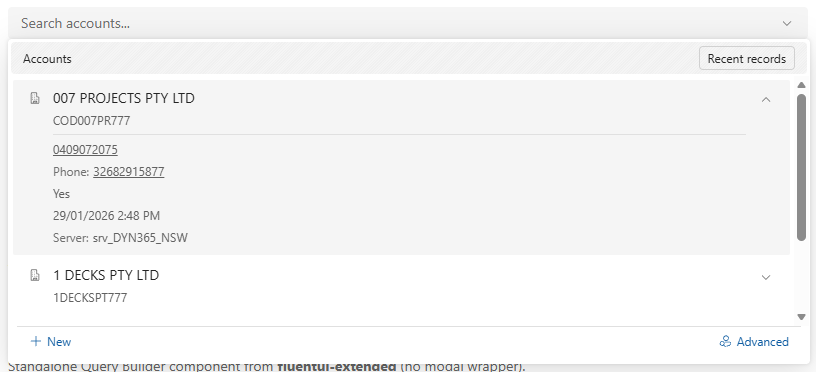
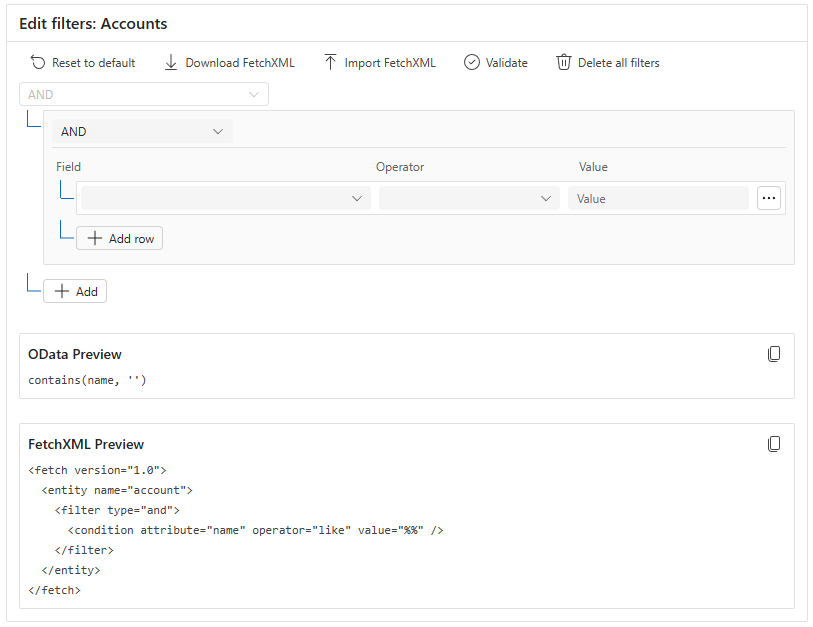

# FluentUI-Extended

Extended components for Fluent UI v9, designed to match Dynamics 365 patterns.

[](https://www.npmjs.com/package/fluentui-extended)
[](https://github.com/garethcheyne/npm-fluentui-extended/actions)

## Why This Library?

We started with the **Lookup** component because it's one of the most requested components in the Dynamics 365 and Power Platform community. Fluent UI v9 doesn't include a Lookup control out of the box, so we built one that matches the native Dynamics 365 experience.

**Have a component request?** Open an issue on [GitHub](https://github.com/garethcheyne/npm-fluentui-extended/issues) and we'll consider adding it!

This project is **open source** and **free to use**. It is provided as-is, without warranty. Community contributions are welcome—feel free to submit pull requests or suggest improvements!

## Installation

```bash
npm install fluentui-extended @fluentui/react-components @fluentui/react-icons
```

## Appearance

Every field-like component in this library takes an `appearance` prop and **defaults it to
`filled-darker`**, which is how Dynamics 365 renders fields natively. Fluent's own default is
`outline`, which reads as foreign on a model-driven form — so the default is deliberately different
from upstream Fluent.

```tsx
<Lookup options={options} />                        // filled-darker
<Lookup options={options} appearance="outline" />   // opt back out
```

Applies to `Lookup`, `QueryBuilder` (every field inside it), `DateTimeField` and `OptionSetField`.
`CommandBar`, `EntityGrid` and `RecordHoverCard` are not field controls and take no `appearance`.

| Value | Notes |
|-------|-------|
| `outline` | Fluent's default |
| `underline` | Not supported by `Textarea`; falls back to `outline` there |
| `filled-darker` | **This library's default** — native Dynamics 365 |
| `filled-lighter` | |
| `filled-darker-shadow` | Deprecated upstream; narrowed to `filled-darker` on dropdowns |
| `filled-lighter-shadow` | Deprecated upstream; narrowed to `filled-lighter` on dropdowns |

The two shadow variants are deprecated in Fluent and will be removed there. They are accepted so
existing callers keep working, but `Combobox` and `Dropdown` never supported them, so a component
containing those narrows to the closest non-shadow fill rather than dropping the value.

## Components

### Lookup

A searchable dropdown component styled after Dynamics 365 lookup fields. Supports async search, expandable option details, and customizable header/footer.



### QueryBuilder

> **🚧 Beta** - This component is in beta. Please report any issues on [GitHub](https://github.com/garethcheyne/npm-fluentui-extended/issues).

An Advanced Find-style query builder for Dynamics 365. Build complex filter conditions with AND/OR logic, serialize to FetchXML or OData, and validate queries against the Dynamics 365 API.



### CommandBar

> **🚧 Beta**

A Dynamics-style command bar. Commands that no longer fit collapse into a "More commands" menu
rather than wrapping to a second row or being clipped.

### EntityGrid

> **🚧 Beta**

A subgrid backed by the Web API: columns named from entity metadata, server-side paging and
sorting, and lookups rendered as names rather than GUIDs.

### DateTimeField

> **🚧 Beta**

A date/time field that respects the attribute's Dynamics `DateTimeBehavior`, so `DateOnly` values
cannot drift a day across timezones.

### OptionSetField

> **🚧 Beta**

An optionset / multi-select picklist field that loads its options from metadata, including global
option sets, and round-trips multi-selects in the comma-separated form Dynamics stores.

### RecordHoverCard

> **🚧 Beta**

A hover card for a record reference. The record is fetched lazily once the pointer settles, and the
result is held so re-opening costs nothing.

## Quick Start

```tsx
import { useState } from 'react';
import { Lookup, LookupOption } from 'fluentui-extended';
import { FluentProvider, webLightTheme } from '@fluentui/react-components';

const options: LookupOption[] = [
  { key: '1', text: 'Contoso Ltd', secondaryText: 'CON001' },
  { key: '2', text: 'Fabrikam Inc', secondaryText: 'FAB001' },
  { key: '3', text: 'Adventure Works', secondaryText: 'ADV001' },
];

function App() {
  const [selected, setSelected] = useState<LookupOption | null>(null);

  return (
    <FluentProvider theme={webLightTheme}>
      <Lookup
        options={options}
        selectedOption={selected}
        onOptionSelect={setSelected}
        placeholder="Search accounts..."
      />
    </FluentProvider>
  );
}
```

## Features

### Basic Selection (with key)

```tsx
const [selectedKey, setSelectedKey] = useState<string | null>(null);

<Lookup
  options={options}
  selectedKey={selectedKey}
  onOptionSelect={(opt) => setSelectedKey(opt?.key ?? null)}
  placeholder="Search..."
/>
```

### Async Search (API Integration)

For async scenarios, use `selectedOption` to persist the display value when options change:

```tsx
function AsyncLookup() {
  const [options, setOptions] = useState<LookupOption[]>([]);
  const [selected, setSelected] = useState<LookupOption | null>(null);
  const [loading, setLoading] = useState(false);

  const handleSearch = async (searchText: string) => {
    setLoading(true);
    const response = await fetch(`/api/accounts?search=${searchText}`);
    setOptions(await response.json());
    setLoading(false);
  };

  return (
    <Lookup
      options={options}
      selectedOption={selected}
      onOptionSelect={setSelected}
      onSearchChange={handleSearch}
      loading={loading}
      searchDebounceMs={300}
      placeholder="Type to search..."
    />
  );
}
```

### With Icons and Expandable Details

Options can include icons and expandable detail rows (click chevron to expand):

```tsx
import { BuildingRegular } from '@fluentui/react-icons';

const options: LookupOption[] = [
  {
    key: '1',
    text: 'Contoso Ltd',
    secondaryText: 'CON001',
    icon: <BuildingRegular />,
    details: [
      { label: 'Phone', value: '555-0100' },
      { label: 'Industry', value: 'Technology' },
      { value: 'Active Customer' },
    ],
    data: { id: 'acc-001', revenue: 5000000 }, // Custom data accessible in onOptionSelect
  },
];
```

### Dynamics 365 Style (Header & Footer)

```tsx
import { Text, Button, Link } from '@fluentui/react-components';
import { AddRegular, PersonSearchRegular } from '@fluentui/react-icons';

<Lookup
  options={options}
  selectedOption={selected}
  onOptionSelect={setSelected}
  header={
    <>
      <Text size={200}>Accounts</Text>
      <Button appearance="outline" size="small">Recent records</Button>
    </>
  }
  footer={
    <>
      <Link style={{ display: 'flex', alignItems: 'center', gap: 4 }}>
        <AddRegular /> New
      </Link>
      <Link style={{ display: 'flex', alignItems: 'center', gap: 4 }}>
        <PersonSearchRegular /> Advanced
      </Link>
    </>
  }
/>
```

### Multi-Entity Lookup with Filter Buttons

Replicate the native Dynamics 365 lookup pattern where users can filter between entity types:

```tsx
import { Text, Button, Link, ToggleButton } from '@fluentui/react-components';
import { BuildingRegular, PersonRegular, ArrowLeftRegular } from '@fluentui/react-icons';

function MultiEntityLookup() {
  const [showAccounts, setShowAccounts] = useState(true);
  const [showContacts, setShowContacts] = useState(true);

  const options: LookupOption[] = [
    { key: 'acc-1', text: 'Contoso Ltd', icon: <BuildingRegular />, details: [...] },
    { key: 'con-1', text: 'John Smith', icon: <PersonRegular />, details: [...] },
  ];

  // Filter based on key prefix
  const filteredOptions = useMemo(() => 
    options.filter(opt => {
      if (opt.key.startsWith('acc-')) return showAccounts;
      if (opt.key.startsWith('con-')) return showContacts;
      return true;
    }), [showAccounts, showContacts]
  );

  return (
    <Lookup
      options={filteredOptions}
      header={
        // Drill-down view when single entity selected
        showAccounts !== showContacts ? (
          <>
            <Link onClick={() => { setShowAccounts(true); setShowContacts(true); }}>
              <ArrowLeftRegular /> All
            </Link>
            <Text weight="semibold">{showAccounts ? 'Accounts' : 'Contacts'}</Text>
          </>
        ) : (
          // Filter toggles when showing all
          <>
            <div style={{ display: 'flex', alignItems: 'center', gap: 4 }}>
              <Text size={200}>Results from:</Text>
              <ToggleButton size="small" checked={showAccounts}
                onClick={() => { setShowAccounts(true); setShowContacts(false); }}>
                Accounts
              </ToggleButton>
              <ToggleButton size="small" checked={showContacts}
                onClick={() => { setShowAccounts(false); setShowContacts(true); }}>
                Contacts
              </ToggleButton>
            </div>
            <Button size="small">Recent records</Button>
          </>
        )
      }
    />
  );
}
```

### Rich Secondary Text with React Elements

Both `secondaryText` and `details` support React elements, not just strings:

```tsx
import { Badge } from '@fluentui/react-components';
import { CheckmarkCircleRegular } from '@fluentui/react-icons';

const options: LookupOption[] = [
  {
    key: '1',
    text: 'John Smith',
    secondaryText: (
      <span style={{ display: 'flex', alignItems: 'center', gap: 6 }}>
        <Badge appearance="tint" color="success" size="small" icon={<CheckmarkCircleRegular />}>
          Active
        </Badge>
        <span>john.smith@contoso.com</span>
      </span>
    ),
    icon: <PersonRegular />,
    details: [
      { label: 'Status', value: <Badge appearance="filled" color="success" size="small">Verified</Badge> },
      { label: 'Role', value: <Badge appearance="tint" color="brand" size="small">Decision Maker</Badge> },
      { value: <span style={{ color: '#0078d4' }}>View full profile →</span> },
    ],
  },
];
```

---

## Test Harness Examples

Run the test harness with `npm run harness` to see all examples in action. The harness is split into
one tab per component, so each can be viewed and screenshotted on its own.

| Example | Tab | Description |
|---------|-----|-------------|
| **Basic Lookup** | Lookup | Simple lookup with expandable details, no header/footer |
| **Header & Footer** | Lookup | D365-style with "Accounts" header and "New" / "Advanced" footer links |
| **Details Only (No Secondary Text)** | Lookup | Options with icons + details but no secondary text; demonstrates icon centering on single-line text |
| **Multi-Entity Filter** | Lookup | Toggle between Accounts/Contacts with drill-down header pattern (← All) |
| **Dynamic Search (Async API)** | Lookup | Simulated 800ms API delay with loading spinner; auto-loads top 5 on open |
| **Live Dynamics Lookup** | Lookup | Connects to real D365 environment via Xrm.WebApi (when connected) |
| **QueryBuilder** | Query Builder | Full Advanced Find-style query builder with FetchXML serialization |
| **Unknown / Invalid Fields** | Query Builder | FetchXML referencing attributes that match no known field, each flagged inline |
| **Command Bar** | Command Bar | Nine commands collapsing into an overflow menu; narrow the window to watch them move |
| **Pinned / no overflow** | Command Bar | A pinned command that never collapses, and horizontal scrolling with overflow disabled |
| **Entity Grid** | Entity Grid | Server-paged accounts with sorting, selection and formatted lookup values (needs a connection) |
| **DateTimeBehavior** | Fields | One picked date serialized three ways, showing which behaviours pass through UTC |
| **OptionSetField** | Fields | Single-select with metadata colours, and a multi-select round-tripping as "1,2" |
| **Record Hover Card** | Hover Card | Static and live record cards with lazy loading on hover intent |

## API Reference

### Resolved Lookup (rest state)

Once a record is selected and the dropdown is closed, the field renders the way a resolved lookup
does on a Dynamics form: the table's icon (or its entity image), the record name as a link, a clear
button, and a magnifier rather than a chevron.

```tsx
<Lookup
  options={options}
  selectedOption={selected}
  onOptionSelect={setSelected}
  entityIcon={<BuildingRegular />}                      // falls back to the option's own icon
  entityImage={account.entityimage_url}                 // wins over the icon when the table has one
  onRecordClick={(option) => openRecord(option.key)}    // clicking the name opens the record
/>
```

Without `onRecordClick` the link styling is still applied but the click falls through to opening the
dropdown, so the affordance never becomes a dead end. Set `recordLinkAppearance={false}` to render the
value as plain input text instead.

### Lookup Props

| Prop | Type | Default | Description |
|------|------|---------|-------------|
| `id` | `string` | auto-generated | Unique identifier for the lookup |
| `appearance` | `FieldAppearance` | `'filled-darker'` | See [Appearance](#appearance) |
| `entityIcon` | `React.ReactNode` | option's `icon` | Table icon shown at rest |
| `entityImage` | `string` | - | Entity image URL, shown in place of the icon |
| `recordLinkAppearance` | `boolean` | `true` | Render the resolved value as a link |
| `onRecordClick` | `(option: LookupOption) => void` | - | Called when the resolved value is clicked |
| `options` | `LookupOption[]` | `[]` | Options to display in the dropdown |
| `selectedKey` | `string \| null` | - | Selected option key (controlled) |
| `selectedOption` | `LookupOption \| null` | - | Selected option object (recommended for async) |
| `onOptionSelect` | `(option: LookupOption \| null) => void` | - | Selection change callback |
| `onSearchChange` | `(searchText: string) => void` | - | Search text change callback |
| `placeholder` | `string` | `'Search...'` | Input placeholder |
| `loading` | `boolean` | `false` | Show loading spinner |
| `noResultsMessage` | `string` | `'No results found'` | Empty state message |
| `clearable` | `boolean` | `true` | Show clear button |
| `minSearchLength` | `number` | `0` | Min chars before search fires |
| `searchDebounceMs` | `number` | `300` | Search debounce delay (ms) |
| `matchInputWidth` | `boolean` | `true` | Match dropdown width to input width |
| `header` | `ReactNode` | - | Header content |
| `footer` | `ReactNode` | - | Footer content |
| `disabled` | `boolean` | `false` | Disable the lookup |
| `open` | `boolean` | - | Controlled open state for the dropdown |
| `onOpenChange` | `(open: boolean) => void` | - | Callback when dropdown open state changes |
| `disableClientFilter` | `boolean` | `false` | Disable client-side filtering of options. Use this when filtering is performed server-side via `onSearchChange` |
| `searchFields` | `string` | - | Hidden searchable text (never rendered). Use this to include additional searchable content (codes, IDs) while displaying JSX in `secondaryText` |

### Client-Side Filtering

By default, the Lookup component filters options client-side as the user types. The filtering logic works as follows:

1. **Primary field (`text`)** — Always searched, regardless of other props
2. **Search fields (`searchFields`)** — If provided, this hidden text is searched (useful when `secondaryText` is JSX)
3. **Secondary text (`secondaryText`)** — Only searched if it's a string (JSX elements are skipped)

This allows you to use rich JSX (badges, icons) in `secondaryText` while still providing searchable text via `searchFields`:

```tsx
const options: LookupOption[] = [
  {
    key: 'PROD-001',
    text: 'Acme Widget',                           // Always searchable
    searchFields: 'PROD-001 SKU-12345 acme-widget', // Hidden searchable text
    secondaryText: (                               // Rich display (not searchable)
      <span style={{ display: 'flex', gap: 4 }}>
        <Badge size="small">PROD-001</Badge>
        <Badge size="small" color="brand">SKU-12345</Badge>
      </span>
    ),
  },
];
```

**Server-Side Filtering:** When using `onSearchChange` to fetch results from an API, set `disableClientFilter={true}` to prevent the client from re-filtering server results:

```tsx
<Lookup
  options={apiResults}
  onSearchChange={(searchText) => fetchFromApi(searchText)}
  disableClientFilter={true}  // API already filtered the results
  loading={isLoading}
/>
```

### Cross-Document Support (Dynamics 365 Iframes)

The Lookup component automatically detects when it's rendered inside a cross-document context (e.g., a React tree mounted into a parent window's document from an iframe). It uses `ownerDocument` and `ownerDocument.defaultView` instead of the global `document` and `window` to ensure:

- **Dismiss on click outside** works correctly (mousedown listener on the correct document)
- **Scroll/resize tracking** responds to the correct window's events
- **Dropdown positioning** uses the correct scroll offsets

### Inherited Input Props

The Lookup component extends Fluent UI's `Input` and supports these standard props:

| Prop | Type | Default | Description |
|------|------|---------|-------------|
| `appearance` | `'outline' \| 'underline' \| 'filled-darker' \| 'filled-lighter'` | `'outline'` | Visual style of the input |
| `size` | `'small' \| 'medium' \| 'large'` | `'medium'` | Size of the input |
| `contentBefore` | `ReactNode` | - | Content before the input text |
| `className` | `string` | - | Additional CSS class |
| `style` | `CSSProperties` | - | Inline styles |

```tsx
// Examples
<Lookup appearance="filled-darker" size="large" ... />
<Lookup appearance="underline" size="small" ... />
```

### LookupOption

```ts
interface LookupOption {
  key: string;                      // Unique identifier (required)
  text: string;                     // Display text (required)
  secondaryText?: ReactNode;        // Secondary line - string, Badge, or JSX
  searchFields?: string;            // Hidden searchable text (never rendered)
  icon?: ReactNode;                 // Icon component (e.g., <BuildingRegular />)
  details?: LookupOptionDetail[];   // Expandable details (chevron appears)
  data?: unknown;                   // Custom data payload for your app
  disabled?: boolean;               // Disable this option
}

interface LookupOptionDetail {
  label?: ReactNode;  // Optional label (e.g., "Phone:" or a Badge)
  value: ReactNode;   // Detail value - string or JSX element
}
```

> **Note:** Both `secondaryText` and `details` support React elements, not just strings. See [Rich Secondary Text](#rich-secondary-text-with-react-elements) for examples. When using JSX in `secondaryText`, use `searchFields` to provide hidden searchable text (see [Client-Side Filtering](#client-side-filtering)).

## Keyboard Navigation

| Key | Action |
|-----|--------|
| `↓` | Open dropdown / Move to next option |
| `↑` | Move to previous option |
| `Enter` | Select highlighted option |
| `Escape` | Close dropdown |
| `Tab` | Close dropdown and move focus |

---

## QueryBuilder

The QueryBuilder component provides an Advanced Find-style interface for building complex queries against Dynamics 365 entities.

### Basic Usage (Dynamics 365)

In Dynamics 365, fields are automatically loaded from entity metadata - no need to pass them manually:

```tsx
import { QueryBuilder, QueryBuilderApplyResult } from 'fluentui-extended';
import { FluentProvider, webLightTheme } from '@fluentui/react-components';

function App() {
  const [fetchXml, setFetchXml] = React.useState<string>('');

  const handleChange = (result: QueryBuilderApplyResult) => {
    setFetchXml(result.fetchXml);
    // Also available: result.odataFilter, result.fetchXmlFilter, result.state
  };

  return (
    <FluentProvider theme={webLightTheme}>
      <QueryBuilder
        entityName="account"
        entityDisplayName="Accounts"
        onSerializedChange={handleChange}
      />
    </FluentProvider>
  );
}
```

### Loading Existing FetchXML

Pass existing FetchXML to pre-populate the query builder:

```tsx
const existingFetchXml = `
  <fetch version="1.0">
    <entity name="account">
      <filter type="and">
        <condition attribute="name" operator="like" value="%Contoso%" />
        <condition attribute="statecode" operator="eq" value="0" />
      </filter>
    </entity>
  </fetch>
`;

<QueryBuilder
  entityName="account"
  initialFetchXml={existingFetchXml}
  onSerializedChange={handleChange}
/>
```

### Getting Values Back

Use `onSerializedChange` to get the query whenever it changes:

```tsx
const handleChange = (result: QueryBuilderApplyResult) => {
  // FetchXML for SDK queries
  console.log(result.fetchXml);
  // <fetch version="1.0"><entity name="account"><filter type="and">...</filter></entity></fetch>

  // OData for Web API  
  console.log(result.odataFilter);
  // name eq 'Contoso' and revenue gt 1000000

  // Just the filter element
  console.log(result.fetchXmlFilter);
  // <filter type="and">...</filter>

  // Current state object (for saving/restoring)
  console.log(result.state);
};
```

### Features

#### Import/Edit/Export FetchXML

Download the current query as FetchXML, import FetchXML from elsewhere, or open the current
query as editable FetchXML:

```tsx
<QueryBuilder
  entityName="account"
  showDownloadFetchXmlButton={true}  // Default: true
  showUploadFetchXmlButton={true}    // Default: true
  showEditFetchXmlButton={true}      // Default: true
/>
```

**Import FetchXML** opens an empty dialog for pasting in a query from elsewhere.

**Edit FetchXML** opens the same dialog prefilled with the current query's FetchXML, so you can
tweak it in place or select-all and paste a different query over it. Applying rebuilds the
builder from whatever is in the box. If the XML doesn't parse, your text is kept and the error
is shown inline.

#### Live Preview

Show real-time preview of the generated queries. The previews can also be toggled from the
toolbar, so these props set the *initial* visibility rather than hiding the previews outright:

```tsx
<QueryBuilder
  entityName="account"
  fields={fields}
  showODataPreview={true}
  showFetchXmlPreview={true}
  showPreviewToggleButtons={true}  // Default: true
/>
```

#### Queries That OData Cannot Express

FetchXML has operators the OData `$filter` syntax has no equivalent for — relative dates
(`last-x-days`, `this-month`), fiscal periods, user context (`eq-userid`) and hierarchy
operators (`under`, `above`). These are evaluated by the FetchXML engine itself.

When a query uses one, it is **omitted from the OData filter** and reported on the result:

```tsx
<QueryBuilder
  entityName="account"
  fields={fields}
  onSerializedChange={(result) => {
    if (result.odataUnsupported.length > 0) {
      // The OData filter is NOT equivalent to the FetchXML - use result.fetchXml instead
      console.warn('Not expressible in OData:', result.odataUnsupported);
    }
  }}
/>
```

Each entry gives the field and operator that could not be translated:

```ts
{ fieldId: 'createdon', fieldLabel: 'Created On', operator: 'last-x-days', operatorLabel: 'Last X Days' }
```

The OData preview shows the same information as a warning. Use `isOperatorConvertibleToOData`
to check a single operator yourself.

#### Validation with Dynamics 365 API

The Validate button checks query structure and optionally tests against the Dynamics 365 API:

```tsx
<QueryBuilder
  entityName="account"
  fields={fields}
  showValidateButton={true}  // Default: true
/>
```

When running inside Dynamics 365:
- Uses native fetch to `/api/data/v9.2/` endpoints
- Executes a test query with `$top=1&$count=true`
- Shows record count or API error message

When running outside Dynamics 365:
- Shows "API validation unavailable — not running in Dynamics 365 environment"

#### Lookup Fields with Async Search

For lookup-type fields, provide an async search callback:

```tsx
const handleLookupSearch = async (fieldId: string, searchText: string) => {
  const response = await fetch(`/api/${fieldId}?search=${searchText}`);
  const data = await response.json();
  return data.map(item => ({
    key: item.id,
    text: item.name,
    secondaryText: item.code,
  }));
};

<QueryBuilder
  entityName="account"
  fields={fields}
  onLookupSearch={handleLookupSearch}
/>
```

#### Debug Tracing

Enable debug tracing to see what's happening inside the component:

```tsx
<QueryBuilder
  entityName="account"
  fields={fields}
  onTrace={(message, data) => {
    console.debug(
      '%c FluentUI-Extended ',
      'background: #845EF7; color: white; padding: 2px 4px; border-radius: 2px; font-weight: bold;',
      message,
      data || ''
    );
  }}
/>
```

This is useful for:
- Debugging related entity field loading
- Tracking optionset metadata fetching
- Understanding when API calls are made
- Troubleshooting field resolution issues

### Standalone Usage (Outside Dynamics 365)

When not running in Dynamics 365, provide fields manually:

```tsx
const fields: QueryBuilderField[] = [
  { id: 'name', label: 'Account Name', dataType: 'string' },
  { id: 'revenue', label: 'Annual Revenue', dataType: 'number' },
  { id: 'statecode', label: 'Status', dataType: 'optionset', options: [
    { label: 'Active', value: 0 },
    { label: 'Inactive', value: 1 },
  ]},
];

<QueryBuilder
  entityName="account"
  fields={fields}
  onSerializedChange={handleChange}
/>
```

### Layout and Scrolling

The header and toolbar stay pinned while the filter groups and previews scroll together as one
region. That scroll only engages when the parent constrains the height — give the wrapper a fixed
`height` (or `maxHeight`) and the component fills it:

```tsx
<div style={{ height: 500, display: 'flex', flexDirection: 'column' }}>
  <QueryBuilder entityName="account" entityDisplayName="Accounts" />
</div>
```

In an unconstrained parent the component simply grows to fit its content and the page scrolls instead.

### Query Options

The root `<fetch>` element carries the same attributes the Dynamics advanced-find editor emits:

```xml
<fetch version="1.0" mapping="logical" no-lock="false" distinct="true">
```

`distinct` defaults to `true`, which matters once related-entity filters are in play — a single
record can otherwise match several linked rows and appear more than once. Override per instance:

```tsx
<QueryBuilder entityName="account" distinct={false} noLock top={50} />
```

These props take precedence over whatever an imported query carried. When no prop is set, options
parsed from `initialFetchXml` are preserved rather than dropped on the next serialize.

### QueryBuilder Props

| Prop | Type | Default | Description |
|------|------|---------|-------------|
| `entityName` | `string` | - | Logical name of the entity (required) |
| `entityDisplayName` | `string` | - | Display name shown in header |
| `fields` | `QueryBuilderField[]` | - | Fields for filtering (auto-loaded via Web API if omitted) |
| `initialFetchXml` | `string` | - | FetchXML to pre-populate the query builder |
| `initialState` | `QueryBuilderState` | - | Initial query state object |
| `distinct` | `boolean` | `true` | Emit `distinct="…"` on the root `<fetch>` |
| `noLock` | `boolean` | `false` | Emit `no-lock="…"` on the root `<fetch>` |
| `top` | `number` | - | Emit `top="N"` to cap the row count; omitted when unset |
| `onSerializedChange` | `(result: QueryBuilderApplyResult) => void` | - | Called when query changes |
| `onLookupSearch` | `(fieldId: string, searchText: string) => Promise<LookupOption[]>` | - | Lookup field search handler |
| `showODataPreview` | `boolean` | `false` | Initial visibility of the OData filter preview |
| `showFetchXmlPreview` | `boolean` | `false` | Initial visibility of the FetchXML preview |
| `showPreviewToggleButtons` | `boolean` | `true` | Show toolbar buttons that toggle the previews |
| `showResetToDefaultButton` | `boolean` | `true` | Show Reset button |
| `showDownloadFetchXmlButton` | `boolean` | `true` | Show Download FetchXML button |
| `showUploadFetchXmlButton` | `boolean` | `true` | Show Import FetchXML button |
| `showEditFetchXmlButton` | `boolean` | `true` | Show Edit FetchXML button |
| `showValidateButton` | `boolean` | `true` | Show Validate button |
| `showDeleteAllFiltersButton` | `boolean` | `true` | Show Delete All button |
| `onTrace` | `(message: string, data?: any) => void` | - | Debug/trace callback for component behavior |

### QueryBuilderField

```ts
interface QueryBuilderField {
  id: string;           // Logical attribute name
  label: string;        // Display label
  dataType: 'string' | 'number' | 'datetime' | 'boolean' | 'optionset' | 'lookup';
  options?: Array<{ label: string; value: string | number }>;  // Optionset and boolean fields
}
```

Options are loaded automatically from entity metadata when `fields` is omitted. Boolean fields
pick up their Dynamics labels (for example "Allowed" / "Not Allowed" rather than Yes / No), with
values `'1'` and `'0'` to match the FetchXML representation.

### QueryBuilderApplyResult

```ts
interface QueryBuilderApplyResult {
  state: QueryBuilderState;      // Current query state
  fetchXmlFilter: string;        // Just the <filter> element
  fetchXml: string;              // Complete FetchXML document
  odataFilter: string;           // OData $filter value
  odataQuery?: string;           // Full OData query URL (requires entitySetName)
  odataUnsupported: QueryBuilderODataUnsupported[];  // Conditions OData cannot express
}

interface QueryBuilderODataUnsupported {
  fieldId: string;        // e.g. "createdon"
  fieldLabel: string;     // e.g. "Created On"
  operator: string;       // e.g. "last-x-days"
  operatorLabel: string;  // e.g. "Last X Days"
}
```

When `odataUnsupported` is non-empty, `odataFilter` is **not** equivalent to `fetchXml` — the
untranslatable conditions have been left out. Use `fetchXml` to run the query.

### Programmatic API

#### Serialize State

```ts
import { serializeQueryBuilderState } from 'fluentui-extended';

const result = serializeQueryBuilderState(state, fields, 'account');
console.log(result.fetchXml);
console.log(result.odataFilter);
```

#### Parse FetchXML

```ts
import { parseFetchXmlToState } from 'fluentui-extended';

const result = parseFetchXmlToState(fetchXmlString, fields);
if (result.state) {
  // Use result.state to populate QueryBuilder
} else {
  console.error(result.error);
}
```

#### Validate State

```ts
import { validateQueryBuilderState } from 'fluentui-extended';

const result = validateQueryBuilderState(state, fields);
if (!result.isValid) {
  result.errors.forEach(err => {
    console.log(`${err.fieldLabel}: ${err.message}`);
  });
}
```

### Supported Operators

| Data Type | Operators |
|-----------|-----------|
| `string` | Contains, Does Not Contain, Begins With, Does Not Begin With, Ends With, Does Not End With, Like, Not Like, Equals, Not Equals, Is Empty, Has Value |
| `number` | Greater Than, Greater Than Or Equal, Less Than, Less Than Or Equal, Between, Not Between, Equals, Not Equals, Is One Of, Is Not One Of, Is Empty, Has Value |
| `datetime` | All number comparisons, plus On / On Or Before / On Or After, relative dates (Today, This Month, Last X Days, Older Than X Months, ...) and fiscal period operators |
| `optionset` | Equals, Not Equals, Is One Of, Is Not One Of, Is Empty, Has Value |
| `lookup` | Equals, Not Equals, Is One Of, Is Not One Of, Is Empty, Has Value, plus user-context (Equals Current User, ...) and hierarchy (Under, Above, ...) operators |
| `boolean` | Equals, Not Equals, Is Empty, Has Value |

Operators map to the [FetchXML condition operators][fetchxml-operators]. Note that FetchXML has
no `contains` operator — "Contains" and "Does Not Contain" are serialized as `like` / `not-like`
with `%` wildcards around the value.

Relative date, fiscal period, user-context and hierarchy operators are FetchXML-only and cannot
be expressed in OData — see [Queries That OData Cannot Express](#queries-that-odata-cannot-express).

[fetchxml-operators]: https://learn.microsoft.com/en-us/power-apps/developer/data-platform/fetchxml/reference/operators

---

## CommandBar

Fluent ships `Toolbar` and `Overflow` as separate primitives. `CommandBar` composes them into the
behaviour a command bar needs: commands that no longer fit move into a "More commands" menu instead
of wrapping or being clipped. Widths are measured from the live DOM, so label length and icons are
accounted for rather than estimated.

```tsx
import { CommandBar } from 'fluentui-extended';
import { AddRegular, EditRegular, DeleteRegular } from '@fluentui/react-icons';

<CommandBar
  items={[
    { key: 'new', text: 'New', icon: <AddRegular />, appearance: 'primary', onClick: handleNew },
    { key: 'edit', text: 'Edit', icon: <EditRegular />, onClick: handleEdit },
    { key: 'delete', text: 'Delete', icon: <DeleteRegular />, dividerBefore: true, onClick: handleDelete },
    {
      key: 'export',
      text: 'Export',
      subItems: [{ key: 'excel', text: 'Export to Excel', onClick: handleExport }],
    },
  ]}
/>
```

### CommandBar Props

| Prop | Type | Default | Description |
|------|------|---------|-------------|
| `items` | `CommandBarItem[]` | - | Commands rendered from the left (required) |
| `farItems` | `CommandBarItem[]` | - | Right-aligned commands; never collapse |
| `size` | `'small' \| 'medium' \| 'large'` | `'small'` | Button size |
| `disableOverflow` | `boolean` | `false` | Scroll horizontally instead of collapsing |
| `overflowAriaLabel` | `string` | `'More commands'` | Label for the overflow trigger |

`CommandBarItem` carries `key`, `text`, `icon`, `onClick`, `disabled`, `appearance`, `checked` (renders
a toggle), `subItems` (renders a menu button, preserved as a submenu when overflowed), `dividerBefore`,
and `pinned`. A pinned command never collapses — use it sparingly, because one that does not fit is
clipped rather than moved.

---

## EntityGrid

A subgrid backed by the Web API. `DataGrid` renders rows you already have; `EntityGrid` fetches them.

Paging uses `Prefer: odata.maxpagesize` and follows `@odata.nextLink`, rather than `$top`/`$skip` —
Dynamics does not support `$skip` for arbitrary offsets, and `$top` suppresses the paging cookie
entirely. Because `nextLink` only moves forward, the URL of each visited page is kept so Previous can
replay it.

```tsx
import { EntityGrid } from 'fluentui-extended';

<EntityGrid
  entityName="account"
  title="Accounts"
  height={420}
  pageSize={25}
  selectable
  columns={[
    { name: 'name', width: 260 },
    { name: 'accountnumber' },
    { name: 'primarycontactid', label: 'Primary Contact' },
  ]}
  onRecordOpen={(id) => Xrm.Navigation.openForm({ entityName: 'account', entityId: id })}
/>
```

Cells prefer the `@OData.Community.Display.V1.FormattedValue` annotation Dynamics attaches, which is
what renders a lookup as a name and an optionset as its label rather than a GUID or an integer. The
grid requests those annotations for you.

### EntityGrid Props

| Prop | Type | Default | Description |
|------|------|---------|-------------|
| `entityName` | `string` | - | Entity logical name (required) |
| `columns` | `EntityGridColumn[]` | primary name attribute | Columns to render |
| `filter` | `string` | - | OData filter applied to every page |
| `defaultSort` | `EntityGridSort` | primary name ascending | Initial sort |
| `pageSize` | `number` | `25` | Rows per page |
| `selectable` | `boolean` | `false` | Show selection checkboxes |
| `onRecordOpen` | `(id, record) => void` | - | Row activation handler |
| `onSelectionChange` | `(ids: string[]) => void` | - | Selection handler |
| `height` | `number \| string` | - | Fixed height for the scrolling body |

`EntityGridColumn` carries `name`, `label` (defaults to the metadata display name), `width`,
`sortable`, and `render(formatted, record)` for custom cells.

Pair it with QueryBuilder by passing that component's `odataFilter` output as `filter`.

---

## DateTimeField

Dynamics has three `DateTimeBehavior` values and they do not agree on what a stored string means, so
a single `new Date(value)` is wrong for two of the three:

| Behavior | Stored as | Conversion |
|----------|-----------|------------|
| `UserLocal` | UTC | Converted to the user's timezone |
| `DateOnly` | Calendar date, no time or zone | None — must never shift |
| `TimeZoneIndependent` | Wall-clock, no zone | None — shown exactly as entered |

The trap is that `new Date('2026-08-06')` parses as UTC midnight, which renders as the 5th anywhere
west of Greenwich, while `toISOString()` on a local date shifts the day for any user east of it.
`DateTimeField` handles both explicitly.

```tsx
import { DateTimeField } from 'fluentui-extended';

<DateTimeField
  label="Estimated Close Date"
  behavior="DateOnly"
  value={value}
  onChange={(stored) => setValue(stored)}  // "2026-08-06", never an ISO timestamp
/>
```

Pass `entityName` and `attributeName` to read the behavior from metadata instead of declaring it.
The conversion helpers are exported for use outside the component:

```ts
import { parseStoredValue, formatStoredValue } from 'fluentui-extended';

const date = parseStoredValue('2026-08-06', 'DateOnly');   // local midnight on the 6th
const stored = formatStoredValue(date, 'DateOnly');        // "2026-08-06"
```

### DateTimeField Props

| Prop | Type | Default | Description |
|------|------|---------|-------------|
| `value` | `string \| Date \| null` | - | Stored value, interpreted per `behavior` |
| `onChange` | `(value: string \| null, date: Date \| null) => void` | - | Serialized value plus the Date |
| `behavior` | `DateTimeBehavior` | `'UserLocal'` | How the attribute is stored |
| `showTime` | `boolean` | `false` | Show a time picker; ignored for `DateOnly` |
| `timeIntervalMinutes` | `number` | `30` | Spacing of the time dropdown entries |
| `entityName` / `attributeName` | `string` | - | Read `behavior` from metadata |
| `clearable` | `boolean` | `true` | Show a clear button |

---

## OptionSetField

```tsx
import { OptionSetField } from 'fluentui-extended';

// Options loaded from metadata
<OptionSetField entityName="account" attributeName="industrycode" value={value} onChange={setValue} />

// Multi-select picklist
<OptionSetField
  options={options}
  multiselect
  value={values}              // accepts [1, 2] or the stored "1,2"
  onChange={(next) => setValues(next as number[])}
/>
```

Two Dynamics details this handles that a plain `Dropdown` does not. A **global option set** leaves
`OptionSet` empty and puts its values on `GlobalOptionSet` instead — reading only the former is why a
dropdown that should be populated comes back empty. And a **multi-select picklist** stores its value
as a comma-separated string, so `"1,2"` and `[1, 2]` have to mean the same thing; `parseSelectedValues`
and `formatMultiSelectValue` are exported for that conversion.

### OptionSetField Props

| Prop | Type | Default | Description |
|------|------|---------|-------------|
| `options` | `OptionSetOption[]` | - | Options; omit to auto-load from metadata |
| `entityName` / `attributeName` | `string` | - | Required for metadata auto-load |
| `multiselect` | `boolean` | `false` | Multi-select picklist behaviour |
| `value` | `number \| number[] \| string \| null` | - | Accepts every stored form |
| `onChange` | `(value: number \| number[] \| null) => void` | - | Selection handler |
| `showColors` | `boolean` | `false` | Render metadata colours as swatches |
| `clearable` | `boolean` | `true` | Allow clearing the selection |

---

## RecordHoverCard

```tsx
import { RecordHoverCard } from 'fluentui-extended';

<RecordHoverCard
  entityName="account"
  recordId={record.accountid}
  columns={['accountnumber', 'telephone1', 'primarycontactid']}
  actions={<Link onClick={open}>Open record</Link>}
>
  <Link>{record.name}</Link>
</RecordHoverCard>
```

The record is fetched only after the pointer has settled on the anchor for `hoverDelayMs` (400 by
default) — without that delay, dragging a pointer across a grid column fires a request per row. The
result is held for the life of the anchor, so re-opening the same card costs nothing, while a failure
is not cached so the next hover retries.

Pass `record` directly to skip loading entirely when the calling grid already has the data.

### RecordHoverCard Props

| Prop | Type | Default | Description |
|------|------|---------|-------------|
| `children` | `React.ReactElement` | - | Anchor element (required) |
| `entityName` / `recordId` | `string` | - | Required to load via the Web API |
| `columns` | `string[]` | primary name only | Columns to request and show |
| `record` | `RecordHoverCardRecord` | - | Supply the record and skip loading |
| `mapRecord` | `(raw) => RecordHoverCardRecord` | - | Map a raw record onto the card |
| `hoverDelayMs` | `number` | `400` | Delay before a hover triggers a fetch |
| `actions` | `React.ReactNode` | - | Footer commands |

---

## Web API Client

The metadata-aware components share one Web API client with a process-wide metadata cache, so two
components mounting in the same tick share a single round trip. Metadata is immutable for the life of
a page, and failures are not cached.

```ts
import { setWebApiBaseUrl, setWebApiFetch, getEntityDefinition, clearMetadataCache } from 'fluentui-extended';

// Standalone / SPA usage - defaults to a relative path, which works inside Dynamics
setWebApiBaseUrl('https://contoso.crm.dynamics.com/api/data/v9.2');

// Supply your own authenticated transport
setWebApiFetch((url, init) => authenticatedFetch(url, init));

const definition = await getEntityDefinition('account');  // EntitySetName, PrimaryIdAttribute, ...
```

Exports: `webApiGet`, `setWebApiFetch`, `setWebApiBaseUrl`, `getWebApiBaseUrl`, `WebApiError`,
`getEntityDefinition`, `getEntityAttributes`, `getEntityOptionSets`, `getAttributeOptions`,
`clearMetadataCache`.

> **Note:** Lookup and QueryBuilder still use their own internal fetch logic and do not yet share
> this client.

---

## Acknowledgments

This library extends [Microsoft's Fluent UI React v9](https://react.fluentui.dev/) components. Thank you to Microsoft and the Fluent UI team for creating and maintaining such an excellent design system.

- [Fluent UI React](https://react.fluentui.dev/)
- [Fluent UI GitHub](https://github.com/microsoft/fluentui)
- [Fluent 2 Design System](https://fluent2.microsoft.design/)

---

## Changelog

> Version format: `YYYY.M.DD` (e.g., `2026.8.30` = August 30, 2026)

### Unreleased

Five new Dynamics 365 components, plus the shared Web API client they sit on.

- 💄 **`filled-darker` is now the default appearance** across every field component — Lookup,
  QueryBuilder, DateTimeField and OptionSetField — matching native Dynamics 365. Fluent's default is
  `outline`. **Breaking for anyone relying on the previous outline look**; pass
  `appearance="outline"` to restore it. See [Appearance](#appearance).
- 💄 **Resolved lookups now render like Dynamics at rest**: table icon or entity image, the record
  name as a link, and a magnifier in place of the chevron. New `entityIcon`, `entityImage`,
  `recordLinkAppearance` and `onRecordClick` props.
- 🐛 **Attribute metadata requests failed against live environments.** `Format` was included in the
  `$select` against the base `Attributes` collection, but it is declared on derived types — Dynamics
  rejects the whole request with *"Could not find a property named 'Format' on type
  'Microsoft.Dynamics.CRM.AttributeMetadata'"*. `Format` and `DateTimeBehavior` are now fetched
  through cast segments and merged in, which also means `DateTimeField`'s metadata auto-load works
  (it could never have resolved a behavior before).

- ✨ **[CommandBar](#commandbar)** — commands that no longer fit collapse into a "More commands" menu
  instead of wrapping or being clipped. Widths are measured from the DOM rather than estimated.
- ✨ **[EntityGrid](#entitygrid)** — a subgrid with columns named from entity metadata, server-side
  paging via `Prefer: odata.maxpagesize` and `@odata.nextLink`, server-side sorting, and lookups
  rendered from their formatted-value annotations rather than as GUIDs.
- ✨ **[DateTimeField](#datetimefield)** — respects the attribute's `DateTimeBehavior`, so `DateOnly`
  and `TimeZoneIndependent` values never pass through UTC and cannot drift a day.
- ✨ **[OptionSetField](#optionsetfield)** — optionset and multi-select picklist field that reads
  global option sets as well as local ones, and round-trips multi-selects as the comma-separated
  string Dynamics stores.
- ✨ **[RecordHoverCard](#recordhovercard)** — lazy record loading gated on hover intent, so dragging
  a pointer across a grid column does not fire a request per row.
- ✨ **[Web API client](#web-api-client)** — one client with a process-wide metadata cache shared by
  the new components. Promises are cached rather than values, so components mounting in the same tick
  share a round trip; failures are not cached. Lookup and QueryBuilder are not yet migrated onto it.
- 🔧 Test harness split into one tab per component.

### 2026.8.40

QueryBuilder layout and query options.

- 🐛 **Toolbar was crushed when the query grew.** In a height-constrained parent the header and
  toolbar were the only flex items able to shrink, so they were compressed and clipped instead of
  the filter list scrolling. Header and toolbar are now pinned, and the filter groups plus previews
  scroll together as one region. See [Layout and Scrolling](#layout-and-scrolling).
- ✨ **Root `<fetch>` query options.** Generated FetchXML now carries `mapping`, `no-lock` and
  `distinct`, matching what the Dynamics advanced-find editor emits. `distinct` defaults to `true`.
  New `distinct`, `noLock` and `top` props override per instance, and options on an imported query
  are preserved through a serialize round-trip rather than silently dropped.
- ✨ Preview cards grow to fit their content instead of scrolling internally.
- 💄 Component header now reads "Query Builder: {entity}" rather than "Edit filters: {entity}".
- 🔧 Test harness split into **Lookup** and **Query Builder** tabs.

### 2026.8.36

QueryBuilder field-type and FetchXML correctness pass.

- 🐛 **Every field resolved as `string`.** `dataTypeFromAttribute` compared `AttributeTypeName.Value`
  (which is suffixed — `MoneyType`, `PicklistType`, `BooleanType`) against unsuffixed names, so only
  lookups were typed correctly. Money fields offered "Contains", optionsets rendered a text box, and
  booleans never reached their branch.
- 🐛 **Optionset and boolean options were never loaded** for main-entity fields. The component's field
  loader fetched attributes and lookup targets but no option metadata.
- 🐛 **Global option sets returned no options** — only `OptionSet` was expanded, never `GlobalOptionSet`.
- 🐛 **Boolean fields** now use their Dynamics labels ("Allowed" / "Not Allowed") instead of hardcoded
  Yes/No, and match on truthiness so a saved `value="1"` no longer displays as "No".
- 🐛 **"Does Not Contain" produced invalid FetchXML** (`operator="not-contain"`, which does not exist).
  Now serialized as `not-like` with `%` wildcards.
- 🐛 **Date picker shifted the day** in UTC+ timezones — `toISOString()` converted local midnight to
  the previous UTC day.
- 🐛 **`IsValidForAdvancedFind` was never requested**, so the filter meant to hide non-filterable
  attributes did nothing.
- 🐛 **"Has Value" left the value box enabled**; no-value operators now disable it correctly.
- 🐛 **"Last X Days" rendered a date picker** instead of a number input.
- 🐛 **`not-between` and fiscal period-and-year operators had no second value input.**
- 🐛 **`link-entity` guessed `from="<entity>id"`**, which is wrong for activity entities
  (`email`, `task`, `appointment` all use `activityid`). Now uses `PrimaryIdAttribute`.
- 🐛 **Invalid OData output.** Untranslatable operators were emitted as a `/* comment */` in the filter
  string; nested related-entity conditions were silently coerced to `eq`. Both are now omitted.
- ✨ **Edit FetchXML** toolbar button — opens the current query as editable FetchXML to tweak or paste
  over (`showEditFetchXmlButton`).
- ✨ **Show/Hide OData and FetchXML** toolbar toggles (`showPreviewToggleButtons`).
- ✨ `QueryBuilderApplyResult.odataUnsupported` reports conditions OData cannot express, surfaced as a
  warning in the OData preview. New `isOperatorConvertibleToOData` helper.
- ✨ Option metadata is fetched once per attribute type rather than once per field.
- 💄 Softer, more rounded containers matching other Dynamics surfaces.
- ⚠️ **Breaking:** `odataUnsupported` is a required field on `QueryBuilderApplyResult`. Consumers only
  reading the result are unaffected; anyone constructing the type will need to add it.

### 2026.8.30

- ✨ Added multi-entity filter pattern with drill-down header ("← All" back button) in test harness
- ✨ Added "Details Only (No Secondary Text)" example to test harness
- ✨ Support for React elements in `secondaryText` and `details[].value` (Badges, icons, styled text)
- ♻️ Improved `aria-selected`/`aria-disabled` attribute handling
- 📝 Documentation overhaul with complete API reference and examples

### 2026.6.12

- ✨ Added React 19 support to peerDependencies
- 📝 Updated README with cross-document support documentation

### 2026.2.19

- 🐛 Fixed cross-document dismiss in Dynamics 365 iframes using `ownerDocument`

### 2026.2.17

- 🐛 Removed `requestAnimationFrame` — handler registers immediately
- 🐛 Switched to capture phase for dismiss handler to prevent D365 DOM interference

### 2026.2.15

- ✨ Added controlled `open` and `onOpenChange` props for programmatic dropdown control
- 🐛 Removed `requestAnimationFrame` from dismiss handler

### 2026.2.13

- ♻️ Rebuilt popup from scratch using custom element (Fluent UI Popover had unexpected behavior)

### 2026.2.11

- 🐛 Added `onOpenChange` callback to sync internal state with Popover dismiss events (outside click, Escape, focus loss)

### 2026.2.10

- 🐛 Fixed Lookup not allowing space character in search input

### 2026.2.8

- ✨ **QueryBuilder**: Native API integration for field metadata
- ✨ **QueryBuilder**: Lookup field support with related entity validation

### 2026.2.7

- ♻️ Removed `Xrm` global dependency — now uses native `/api/data/v9.2/` fetch calls

### 2026.2.6

- ♻️ **QueryBuilder**: Refactored to reuse shared components and styles

### 2026.2.5

- ✨ **QueryBuilder**: Initial release (beta) — Advanced Find-style query builder
- ♻️ **Lookup**: Changed from options-only to popup-based rendering

### 2026.2.3

- ✨ Added `id` prop — auto-generated if not provided

### 2026.2.2

- 🐛 Fixed classic JSX transform for React 16 compatibility
- ✨ Added React 16.8+ support

### 2026.2.1

- 🎉 Initial release
- ✨ Lookup component with async search, expandable details, header/footer

## License

MIT
